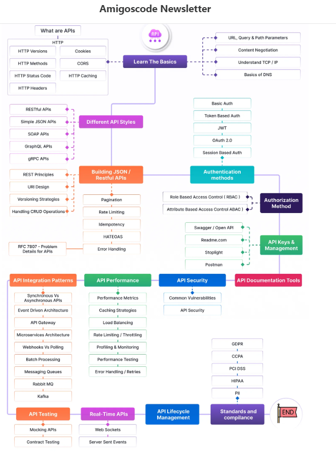
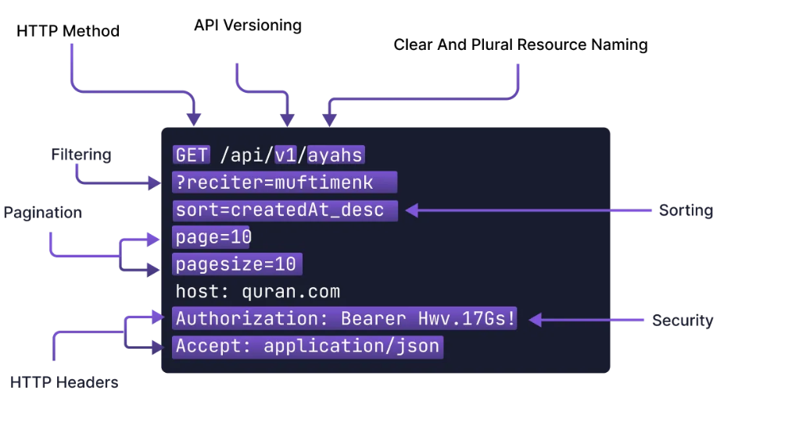

# API là gì
    - API là một tập hợp các commands, functions, protocols, objects,... giúp 2 Application có thể tương tác và trao đổi dữ liệu qua lại với nhau.
    - Ứng dụng FE giao tiếp với BE
        - BE : Xây dựng API lấy danh sách users http://api.com/users
        - FE : Sử dụng API của BE để lấy dữ liệu về

# RESTful API
    - RESTful API là một tiêu chuẩn được sử dụng trong việc thiết kế API cho các application, software để tạo sự thuận tiện cho việc quản lý các resource.
    - RESTful API là một API sử dụng các nguyên tắc của REST để giao tiếp giữa các ứng dụng. Các dịch vụ web RESTful thường sử dụng giao thức HTTP để gửi và nhận dữ liệu, và chúng được thiết kế để tương tác với tài nguyên (resources) qua các phương thức HTTP như GET, POST, PUT, DELETE.
    - Đặc điểm của RESTful API:
        + Stateless (Không trạng thái): Mỗi yêu cầu từ máy khách tới máy chủ phải chứa tất cả thông tin cần thiết để máy chủ có thể hiểu và xử lý yêu cầu. Máy chủ không lưu trữ thông tin trạng thái của người dùng giữa các yêu cầu.

        + Client-Server (Máy khách - Máy chủ): RESTful API dựa trên mô hình client-server, nơi máy khách và máy chủ được tách biệt. Máy khách thực hiện yêu cầu và máy chủ cung cấp tài nguyên.

        + Cacheable (Có thể lưu cache): Các phản hồi từ máy chủ nên được chỉ định là có thể lưu trữ hay không để cải thiện hiệu suất và giảm tải cho máy chủ.

        + Layered System (Hệ thống phân lớp): RESTful API có thể được thiết kế với các tầng trung gian (middleware) để xử lý các chức năng khác nhau như bảo mật, cân bằng tải mà không ảnh hưởng đến sự tương tác giữa máy khách và máy chủ.

        + Uniform Interface (Giao diện thống nhất): Giao diện giữa máy khách và máy chủ cần được thống nhất, điều này giúp các thành phần trong hệ thống tương tác với nhau một cách dễ dàng.

        + Resource Identification (Định danh tài nguyên): Các tài nguyên trong RESTful API được xác định bằng các URL hoặc URIs (Uniform Resource Identifiers).
    
    
# CI/CD là gì ?
`https://viblo.asia/p/ci-cd-va-devops-07LKXYXDZV4`

# Redisearch là gì ?

`https://2coffee.dev/bai-viet/redisearch-la-gi-estacks-dang-su-dung-redisearch-lam-co-so-du-lieu`
- sử dụng redis phục vụ cho việc cache dữ liệu thì giờ đây redisearch được sinh ra vừa kế thừa được tốc độ, đồng thời cung cấp khả năng truy vấn cực kì mạnh mẽ.
- Như đã nói ở trên trước khi tôi có sử dụng mysql. Nói về độ ổn định thì mysql cho tính ổn định rất cao, khả năng truy vấn dữ liệu cũng rất tốt. Có điều nó sử dụng tương đối nhiều bộ nhớ, kèm theo đó khả năng tìm kiếm full-text chưa được mạnh mẽ khi tôi yêu cầu chức năng tìm kiếm là chủ lực cho blog.

# API Development Roadmap for Developers

[https://blog.amigoscode.com/p/api-development-roadmap-for-developers]

1. What Are APIs?

APIs, short for Application Programming Interfaces, are sets of rules and protocols that allow different software components to communicate with one another. Whether you're building mobile apps, web apps, or integrating third-party services, APIs play a critical role in facilitating these interactions.

2. Learning the Basics HTTP and HTTPS

Before diving into API design or implementation, it's essential to understand the underlying protocols and standards that govern API communication, particularly HTTP. Some core concepts include:

+ **HTTP Versions:** Understand the differences between HTTP/1.1, HTTP/2, and HTTP/3.
+ **HTTP Methods:** Learn about GET, POST, PUT, DELETE, and more.
+ **HTTP Status Codes:** Get familiar with codes such as 200 (OK), 404 (Not Found), and 500 (Server Error).
+ **HTTP Headers & Cookies:** 
    
    + **HTTP Headers** là các cặp key-value được gửi kèm theo yêu cầu (request) hoặc phản hồi (response) HTTP. Chúng cung cấp thông tin bổ sung về request hoặc response, như loại nội dung, phương thức xác thực, thông tin cache(Content-Type, Authorization)
    + **Cookies** Cookies là các mẩu dữ liệu nhỏ được server gửi về client và được lưu trữ trên trình duyệt. Khi client gửi request tiếp theo đến cùng server, cookie này sẽ được gửi kèm để server có thể nhận diện và xử lý thông tin.
+ **CORS & Caching:** Understand how to handle cross-origin requests and optimize performance with caching.

    + **CORS (Cross-Origin Resource Sharing)** là một cơ chế bảo mật của trình duyệt cho phép hoặc chặn các yêu cầu từ một nguồn khác với nguồn mà tài nguyên đó được cung cấp. CORS được sử dụng để kiểm soát xem tài nguyên trên một server có thể được truy cập từ một domain khác hay không.
    + **Caching** là kỹ thuật lưu trữ tạm thời dữ liệu để tăng tốc độ truy cập và giảm tải cho server. Khi dữ liệu được cache, nó sẽ được lưu trữ tại một vị trí gần người dùng (như trên trình duyệt hoặc server proxy), giúp giảm thời gian truy xuất và cải thiện hiệu suất hệ thống.

3. Exploring Different API Styles
+ **RESTful APIs**: The most common style, focusing on stateless, resource-based interactions (client-server).
+ **Simple JSON APIs:** Lightweight and commonly used for data exchange.
+ **SOAP APIs**: Known for strict rules and extensive security features, SOAP is typically used in enterprise environments, using SML exchange data.
+ **GraphQL:** Allows for more flexible queries and is great for optimizing data fetching.

4. Building RESTful APIs

Building a RESTful API involves more than just exchanging data. Here are some key considerations for designing robust and maintainable APIs:
+ REST Principles: Stick to standard RESTful design principles to create scalable and maintainable APIs.
+ URI Design: Follow best practices for creating intuitive and consistent resource paths.
+ Versioning Strategies: Always plan for backward compatibility by versioning your API endpoints.
+ Handling CRUD Operations: Ensure efficient creation, reading, updating, and deletion of resources.
+ Pagination & Rate Limiting: Implement strategies to control data flow and prevent overloading.
+ Idempotency: Ensure that multiple identical requests lead to the same outcome, especially for write operations.
+ Error Handling: Properly handle and communicate errors using standards like RFC 7807.

